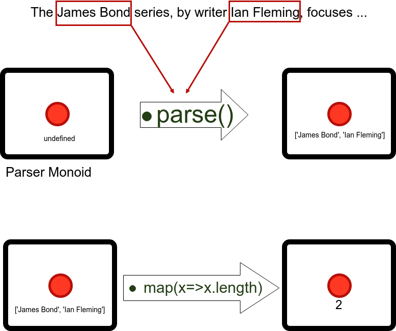

# Masala Parser: Javascript Parser Combinators

[](https://badge.fury.io/js/%40masala%2Fparser)
[](https://travis-ci.org/d-plaindoux/masala-parser)
[](https://coveralls.io/r/d-plaindoux/masala-parser?branch=master)
[](http://github.com/badges/stability-badges)

Masala Parser is inspired by the paper titled:
[Direct Style Monadic Parser Combinators For The Real World](https://www.microsoft.com/en-us/research/wp-content/uploads/2016/02/parsec-paper-letter.pdf).

Masala Parser is a Javascript implementation of the Haskell **Parsec**.
 It is plain Javascript that works in the browser, is tested with more than 450 unit tests, covering 100% of code lines.

### Use cases

* It can create a full parser from scratch as an alternative for Lex & yacc
* It can extract data from a big text and replace complex regexp
* It can validate complete structure with variations
* It can parse and execute custom operations

Masala Parser keywords are **variations** and **maintainability**. You won't
need theoretical bases on languages for extraction or validation use cases.

# Usage

With Node Js or modern build        
        
        npm install -S @masala/parser

Or in the browser 

* [download Release](https://github.com/d-plaindoux/masala-parser/releases)
* `<script src="masala-parser.min.js"/>`

Check the [Change Log](./changelog.md) if you can from a previous version.


# Quick Examples

## Floor notation

```js
// N: Number Bundle, C: Chars Bundle
const {Streams, N, C}= require('@masala/parser');

const stream = Stream.ofString('|4.6|');
const floorCombinator = C.char('|').drop()
    .then(N.numberLiteral)      // we have ['|', 4.6], we keep 4.6
    .then(C.char('|').drop())   // we have [4.6, '|'], we keep 4.6
    .map(x =>Math.floor(x));

// Parsec needs a stream of characters
const parsing = floorCombinator.parse(stream);
assertEquals( 4, parsing.value, 'Floor parsing');
```

## Explanations

According to Wikipedia *"in functional programming, a parser combinator is a
higher-order function that accepts several parsers as input and returns a new
parser as its output."*

## The Parser

Let's say we have a document :

>>> The James Bond series, by writer Ian Fleming, focuses on a fictional British Secret Service agent created in 1953, who featured him in twelve novels and two short-story collections. Since Fleming's death in 1964, eight other authors have written authorised Bond novels or novelizations: Kingsley Amis, Christopher Wood, John Gardner, Raymond Benson, Sebastian Faulks, Jeffery Deaver, William Boyd and Anthony Horowitz.

There are many way to analyze this document, for example finding names inside. But what is a name ? We can say that it
 is a combination of two following words starting with an uppercase. But what is a word ? What are following words ?
  What is a starting uppercase word ?

The goal of a parser is to find out. The goal of Parsec is to make this easy.

## The Monoid structure

A monoid is an object with functions and one single encapsulated value. Have you heard of jQuery ? The `$` object is a monoid, where
 the value is the DOM selection.
The parser will read through the document and aggregate values. The single value of the monoid will be modified by the document stream,
  but can also be modified by function calls, such as the `map()` function. The value is the `Response` of your `Parser`.



A Http Promise is also a good example. It will give you later the value. Masala does the same: it will give you
the `Response` after parsing. 


## Hello 'X'

The goal is check that we have Hello 'something', then to grab that *something*

```js
// Plain old javascript
const {Streams,  C}= require('@masala/parser');

var helloParser = C.string("Hello")
                    .then(C.char(' ').rep())
                    .then(C.char(`'`)).drop()
                    .then(C.letter.rep()) // keeping repeated ascii letters
                    .then(C.char(`'`).drop());    // keeping previous letters

var parsing = helloParser.parse(Streams.ofString("Hello 'World'"));
// C.letter.rep() will give an array of letters
assertArrayEquals(['W','o','r','l','d'], parsing.value.array(), "Hello World joined");
```

## Improvement with Extractor Bundle

We have used a complex combinator that shows us how to parse character by character. But you can build or use
 higher level parsers to do the same job. **Masala Parser** offers an Extractor Bundle that could replace
  all of your regexp extractions.


```js
import {Streams, X} from '@masala/parser'

const line = Streams.ofString("Hello 'World'");

// Adding a `'` as a word separator;  
const x = new X({moreSeparators: `'`});

const helloParser = x.words(false) // false because we don't keep separators
                     .map(x.last); // We had "Hello" and "World"

const value = helloParser.parse(line).value;

test.equals(value, 'World');
```


# Parser Combinations

Let's use a real example. We combine many functions that returns a new Parser. And each new Parser
is a combination of Parsers given by the standard bundles or previous functions.

```js
import  {Streams, N,C, F} from '@masala/parser';

const blanks = ()=>C.char(' ').optrep();

function operator(symbol) {
    return blanks().thenRight(C.char(symbol)).thenLeft(blanks());
}

function sum() {
    return N.integer.thenLeft(operator('+')).then(N.integer)
        .map(values => values[0] + values[1]);
}

function multiplication() {
    return N.integer.thenLeft(operator('*')).then(N.integer)
        .map(values => values[0] * values[1]);
}

function scalar() {
    return N.integer;
}

function combinator() {
    return F.try(sum())
        .or(F.try(multiplication()))    // or() will often work with try()
        .or(scalar());
}

function parseOperation(line) {
    return combinator().parse(Streams.ofString(line));
}

assertEquals(4, parseOperation('2   +2').value, 'sum: ');
assertEquals(6, parseOperation('2 * 3').value, 'multiplication: ');
assertEquals(8, parseOperation('8').value, 'scalar: ');
```

A curry paste is an higher order ingredient made from a good combination of spices.


## Precedence

Precedence is a technical term for priority. Using:

```js
function combinator() {
    return F.try(sum())
        .or(F.try(multiplication()))    // or() will often work with try()
        .or(scalar());
}

console.info('sum: ',parseOperation('2+2').value);
```

We will give priority to sum, then multiplication, then scalar. If we had put `scalar()` first, we would have first
accepted `2`, then what could we do with `+2` alone ? It's not a valid sum !

## try(x).or(y)

`or()` will often be used with `try()`. Like Haskell's Parsec, Masala-Parser can parse infinite look-ahead grammars but
 performs best on predictive (LL[1]) grammars.

With `try()`, we can look a bit ahead of next characters, then go back:

        F.try(sum()).or(F.try(multiplication())).or(scalar())
        // try(sum()) parser in action
        2         *2
        ..ok..ok  ↑oups: go back and try multiplication. Should be OK.


Suppose we do not `try()` but use `or()` directly:

        sum().or(multiplication()).or(scalar())
        // testing sum()
        2         *2
        ..ok..ok  ↑oups: cursor is not going back. Having now to test '*2' ;
                                                   Is it (multiplication())? No ; or(scalar()) ? neither

`try()` has some benefits, but costs more in memory and CPU, as you test things twice.
 You should avoid long sequences of `try()` if memory is constrained. If possible, you can use `or()` without `try()`
  when there is no *starting ambiguity*.

`N.integer.or(C.letter())` doesn't require a `try()`.


# Simple documentation of Core bundles

## Core Parser Functions

Here is a link for [Core functions documentation](./documentation/parser-core-functions.md).

It will explain `then()`, `drop()`, `map()`, `rep()`, `opt()` and other core functions of the Parser
with code examples.


## The Response

A Parser can parse. When it finished this work, it can return two subtypes of `Response`:
 
* `Accept` when it found something.    
* `Reject` if it could not.


```js

    let response = C.char('a').rep().parse(Streams.ofString('aaaa'));
    assertEquals(response.value.join(''), 'aaaa' );
    assertEquals(response.offset, 4 );
    assertTrue(response.isAccepted());
    assertTrue(response.isConsumed());
    
    // Partially accepted
    response = C.char('a').rep().parse(Streams.ofString('aabb'));
    assertEquals(response.value.join(''), 'aa' );
    assertEquals(response.offset, 2 );
    assertTrue(response.isAccepted());
    assertFalse(response.isConsumed());

```


## The Flow Bundle

The flow bundle will mix ingredients together.

For example if you have a Parser `p`, `F.not(p)` will accept anything
that does not satisfy `p`

All of these functions will return a brand new Parser that you can combine with others.

Most important:

* `F.try(parser).or(otherParser)`: Try a parser and come back to `otherParser` if failed
* `F.any`: Accept any character (and so moves the cursor)
* `F.not(parser)`: Accept anything that is not a parser. Often used to accept until a given *stop*  
* `F.eos`: Accepted if the Parser has reached the **E**nd **O**f **S**tream
* `F.moveUntil(string|stopParser)`: Alternative for **regex**. Will traverse the document **until** the *stop parser*
    - returns `undefined` if *stop* is not found
    - returns all characters if *stop* is found, and set the cursor at the spot of the stop
* `F.dropTo(string|stopParser)`: Will traverse the document **including** the *stop parser*
    

Others:

* `F.lazy`: Makes a lazy evaluation. May be used for Left recursion (difficult)
* `F.parse(parserFunction)`: Create a new Parser from a function. Usually, you won't start here.
* `F.subStream(length)`: accept any next characters  
* `F.returns`: forces a returned value
* `F.error`: returns an error. Parser will never be accepted
* `F.satisfy`: check if condition is satisfied
* `F.startsWith(value)`: create a no-op parser with initial value 


## The Chars Bundle

[General use](./documentation/chars-bundle.md)

* `letter`: accept a european letter (and moves the cursor)
* `letters`: accepts many letters and returns a string
* `letterAs(symbol)`: accepts a european(default), ascii, or utf8 Letter. [More here](./documentation/chars-bundle.md)
* `lettersAs(symbol)`: accepts many letters and returns a string
* `emoji`: accept any emoji sequence. [Opened Issue](https://github.com/d-plaindoux/masala-parser/issues/86).
* `notChar(x)`: accept if next input is not `x`
* `char(x)`: accept if next input is `x`
* `charIn('xyz')`: accept if next input is `x`, `y` or `z`
* `charNotIn('xyz')`: accept if next input is not `x`, `y` or `z`
* `subString(length)`: accept any next *length* characters and returns the equivalent string
* `string(word)`: accept if next input is the given `word`  
* `stringIn(words)`: accept if next input is the given `words` [More here](./documentation/chars-bundle.md)
* `notString(word)`: accept if next input is *not* the given `word`
* `charLiteral`: single quoted char element in C/Java : `'a'` is accepted
* `stringLiteral`: double quoted string element in java/json: `"hello world"` is accepted
* `lowerCase`: accept any next lower case inputs
* `upperCase`: accept any next uppercase inputs


## The Numbers Bundle


* `numberLiteral`: accept any float number, such as -2.3E+24, and returns a float    
* `digit`: accept any single digit, and return a **single char** (or in fact string, it's just javascript)
* `digits`: accept many digits, and return a **string**. Warning: it does not accept **+-** signs symbols.
* `integer`: accept any positive or negative integer


# The Standard bundles

Masala Parser offers a generic Token Bundle, a data Extractor, a Json parser, and an experimental
and incomplete markdown parser.

## The Token Bundle


* `email`: accept a very large number of emails
* `date`: accept a very small number of dates (2017-03-27 or 27/03/2017)
* `blank(nothing|string|parser)`: accept standard blanks (space, tab), or defined characters, or a combined Parser
* `eol`: accept **E**nd **O**f **L**ine `\n` or `\r\n`

## The Extractor Bundle

The Extractor will help you to find valuable data in complex text (emails sent by platforms, website crawling...)

`Parser` is a `class`, but you never use `new Parser()`. Other bundles are simple JS objects. The `X` extractor is a
class to make customization easy. So you can extend it to override methods, or use its constructor to change options.

### X constructor

`const x = new X(options)` with default options to:

        {
            spacesCharacters:' \n',
            wordSeparators:C.charIn(' \n:-,;'),
            letter : C.letter,
            moreSeparators: null
        }

* `spacesCharacters`: series of chars. Use `x.spaces()` to accept given spaces
* `wordSeparators`: Parser. Use `x.words()` to select words separated with `wordSeparators`
* `letter`: Parser. Original `C.letter` are occidental letters. See [opened issue](https://github.com/d-plaindoux/masala-parser/issues/43).
* `moreSeparator`: series of chars. You don't have to redefine `wordSeparators` when using `{moreSeparator:'$£€'}`

### X functions

* `x.spaces()`: accept spaces defined in `options.spacesCharacters`
* `x.digits()`: accept many digits and returns a string
* `x.word()`: accept a word that satisfies repetition of `options.letter`. Returns the word as a string
* `x.words(keepSpaces=true)`: accept repetition of previous words. Set `keepSpaces=false` to removes spaces from result
* `x.wordsIn(arrayOfStrings, keepSpaces = true)`: accept given words, separated by previously defined `wordSeparators`
* `x.first`, `x.last`: mappers to pick first or last word  
    - example: `x.words().map(x.first)` will pick the first word of the document


## JSON Bundle and Markdown Bundle

The JSON bundle offers an easy to use JSON parser. Obviously you could use native `JSON.parse()` function. So it's more
  a source of examples to deal with array structure.

**Warning: The Markdown bundle is under active development and will move a lot !**

The Markdown parser will not compile Markdown in HTML, but it will gives you a Javascript object (aka JSON structure).
The Markdown bundle offers a series of Markdown tokens to build your own **meta-markdown** parser.

Tokens are:

* `blank`: blanks in paragraphs, including single end of line
* `eol`: `\n` or `\r\n`
* `lineFeed`: At least two EOL
* `fourSpacesBlock`: Four spaces or two tabs (will accept option for x spaces and/or y tabs)
* `stop`: End of pure text
* `pureText`: Pure text, which is inside italic or bold characters
* `italic`: italic text between `*pureText*` or `_pureText_`
* `bold`: bold text between `**pureText**`
* `code`: code text between `` `pureText` `` (double backticks for escape not yet supported)
* `text (pureTextParser)`: higher level of pureText, if you need to redefine what is pureText
* `formattedSequence (pureText, stop)`: combination of pureText, italic, bold and code
* `formattedParagraph`: formattedSequence separated by a lineFeed
* `titleLine`: `title\n===` or `title\n---` variant of title
* `titleSharp`: `### title` variant of title
* `title`: titleLine or titleSharp
* `bulletLv1`: Level one bullet
* `bulletLv2`: Level two bullet
* `bullet`: Level one or two bullets
* `codeLine`: Four spaces indented code block line


## License

Copyright (C)2016-2017 D. Plaindoux.

This program is  free software; you can redistribute  it and/or modify
it  under the  terms  of  the GNU  Lesser  General  Public License  as
published by  the Free Software  Foundation; either version 2,  or (at
your option) any later version.

This program  is distributed in the  hope that it will  be useful, but
WITHOUT   ANY  WARRANTY;   without  even   the  implied   warranty  of
MERCHANTABILITY  or FITNESS  FOR  A PARTICULAR  PURPOSE.  See the  GNU
Lesser General Public License for more details.

You  should have  received a  copy of  the GNU  Lesser General  Public
License along with  this program; see the file COPYING.  If not, write
to the  Free Software Foundation,  675 Mass Ave, Cambridge,  MA 02139,
USA.
